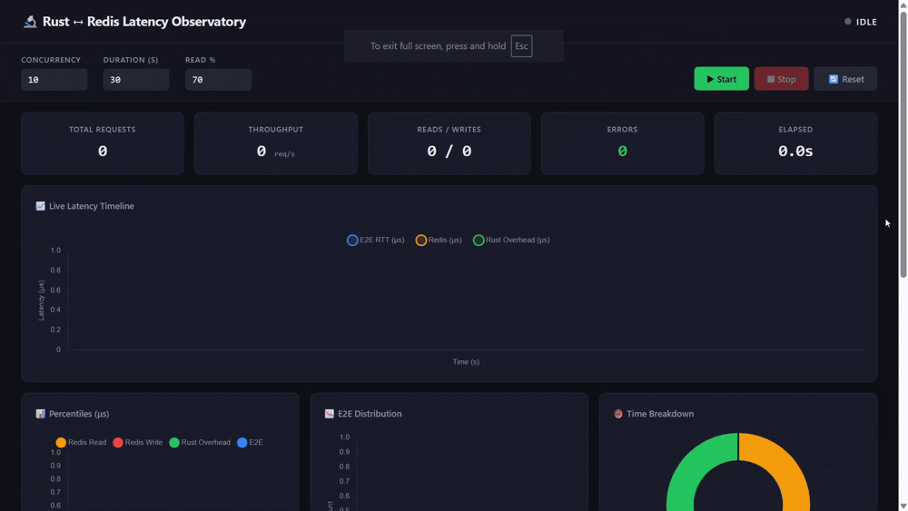

```bash
# terminal 1 - start redis
redis-server

# terminal 2 - run the project
cd rust-redis-bench
cargo run --release

# output
# Seeding 10,000 users and 500 products into redis
# Seed complete in 1.2s
# Server running at http://localhost:3000
# Dashboard at http://localhost:3000
# metrics SSE at http://localhost:3000/api/metrics/stream

# terminal 3 (optional) or just use the dashboard
curl -X POST http://localhost:3000/api/benchmark/start \
    -H "Content-Type: application/json" \
    -d '{"concurrency": 20, "duration_secs": 60, "read_pct": 70}'
```


